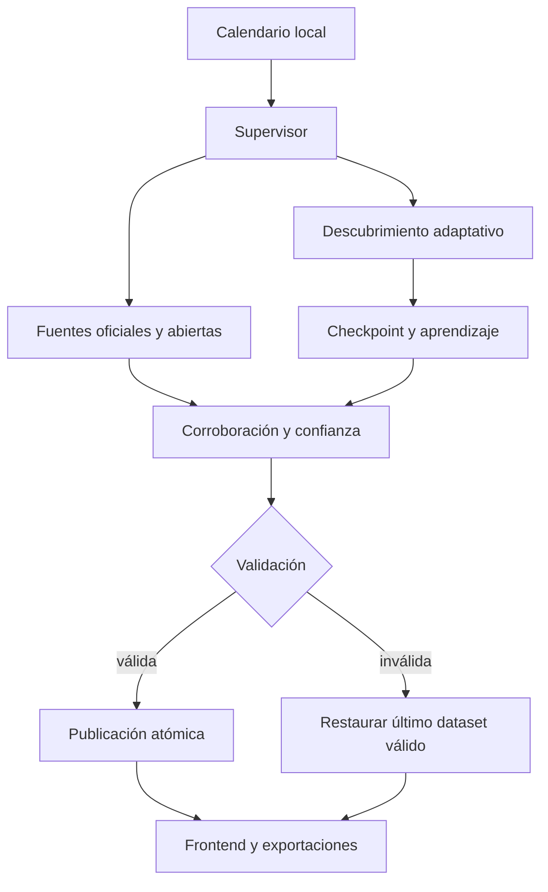

# Westcon Iberia Decision Intelligence v3.0

Aplicación ejecutiva estática para inteligencia pública de fabricantes, mayoristas, integradores, tendencias, arquitecturas, sinergias y solapes en España y Portugal.

La v3.0 rehace el proceso de actualización para que sea acotado, reanudable, observable y tolerante a fallos. No necesita bases de datos, servidores de aplicación, claves de búsqueda ni suscripciones. Puede publicarse en GitHub Pages y actualizar sus JSON mediante GitHub Actions.

## Principios no negociables

- Solo fuentes gratuitas y accesibles públicamente.
- Gartner, IDC, Forrester y otras consultoras: únicamente páginas, notas, resúmenes, webinars y materiales públicos; nunca se raspan ni reconstruyen informes licenciados.
- Una entidad configurada para investigar no se presenta como relación comercial demostrada.
- Descubrimiento, evidencia e inferencia se mantienen separados.
- ES, PT, Iberia, EMEA y global no se mezclan.
- La ausencia de evidencia pública se muestra como gap, no como cero ni como inexistencia.
- Solo se muestra una acción cuando el gate global alcanza exactamente 100/100 y tiene corroboración suficiente; el resto queda como hipótesis de investigación.

## Qué incluye

- Vista ejecutiva, fabricantes, mayoristas, integradores, tendencias, arquitecturas, sinergias/solapes, fuentes y operación.
- Universo semilla abierto: 24 consultoras, 27 mayoristas y más de 55 integradores, ampliable por descubrimiento dinámico.
- Perfiles con portfolio, presión de canal, integradores, clientes públicos, posicionamiento, demanda pública, competencia, certificaciones/señales y gaps.
- Arquitecturas técnicas con sinergias, dependencias, límites y conflictos de plataforma.
- Tabla de fabricantes con columnas seleccionables, ordenables y movibles mediante arrastrar y soltar.
- Hover contextual para métricas e inferencias: explicación, confianza y fuentes principales.
- Exportación PDF y PowerPoint con portada ejecutiva, metadatos, campos elegidos y gate de acciones.
- Panel de operación con estado del run, etapas, salud por dominio y fallos trazados.

## Fuentes gratuitas

| Capa | Fuentes |
| --- | --- |
| Primarias | webs, notas, partner locators, casos, sitemaps y páginas oficiales |
| Noticias | Google News RSS |
| Eventos globales | GDELT DOC 2.0 |
| Histórico portugués | Arquivo.pt |
| Descubrimiento web | Common Crawl, siempre con revalidación en la URL oficial viva |
| Contratación UE | TED Search API pública |
| Contratación España | PLACSP y feeds oficiales de agregación |
| Contratación Portugal | catálogo y recursos públicos de dados.gov.pt / Portal BASE |
| Consultoras | contenido público de Gartner, IDC, Forrester, Omdia, Canalys, Dell’Oro, Synergy, ISG y otras |

No hay variables `BRAVE_SEARCH_API_KEY`, `BASE_API_TOKEN` ni otra clave de búsqueda en los workflows o en el colector.

## Arquitectura de actualización



El motor trabaja por lotes pequeños y con un presupuesto máximo. Si una fuente responde lentamente, agota cuota pública o falla, abre un circuito temporal, conserva lo conseguido y deja la cola pendiente para el siguiente ciclo. El supervisor emite heartbeats, impone un límite exterior, valida el resultado y recupera el último dataset válido si fuera necesario.

## Instalación rápida

Requisitos: Python 3.11 o 3.12, Node.js para las pruebas de UI y un repositorio GitHub si se desea automatización/publicación.

```bash
python -m venv .venv
source .venv/bin/activate
pip install -r requirements.txt
python scripts/configure_updates.py --show
python scripts/selftest.py
python scripts/test_resilience.py
python scripts/test_schedule.py
python scripts/validate.py
python -m http.server 8000
```

En Windows PowerShell, active el entorno con:

```powershell
.venv\Scripts\Activate.ps1
```

Abra `http://localhost:8000`. Para instalar sobre v2.1 sin perder aprendizaje o histórico, siga [INSTALACION_SOBRE_V2.1.md](INSTALACION_SOBRE_V2.1.md).

## Configurar actualizaciones automáticas

La configuración efectiva vive en `config/update_schedule.json`. No edite el YAML a mano; utilice:

```bash
python scripts/configure_updates.py \
  --timezone Europe/Madrid \
  --daily 06:23 \
  --weekly SUN@04:47 \
  --monthly 1@03:17
```

Otros ejemplos:

```bash
python scripts/configure_updates.py --timezone Europe/Lisbon
python scripts/configure_updates.py --weekly off
python scripts/configure_updates.py --daily 07:10 --weekly SAT@05:20 --monthly 2@04:30
python scripts/configure_updates.py --show
```

El script modifica de forma coordinada la configuración local y los bloques marcados de los tres workflows. Genera candidatos UTC de verano e invierno; `schedule_guard.py` ejecuta únicamente el candidato que coincide con la hora local y evita repeticiones. `workflow_dispatch` permite lanzar cualquier perfil manualmente.

| Perfil | Uso | Límite exterior |
| --- | --- | ---: |
| `daily` | cambios recientes y cola prioritaria | 12 min |
| `deep` | barrido semanal y recalibración | 30 min |
| `exhaustive` | long tail, histórico y universo ampliado | 55 min |

Ejecución manual local:

```bash
python scripts/research_supervisor.py --profile daily --max-runtime 720
python scripts/research_supervisor.py --profile deep --max-runtime 1800 --fallback-runtime 240
python scripts/research_supervisor.py --profile exhaustive --max-runtime 3300 --fallback-runtime 300
```

No ejecute `research.py` dos veces con `||`: el supervisor ya gestiona timeout, fallback, validación y recuperación.

## Trazabilidad de datos y fallos

| Archivo | Contenido |
| --- | --- |
| `data/research.latest.json` | dataset publicado, run ID, motores y etapas |
| `data/run_manifest.latest.json` | duración, resultado y estado de cada etapa |
| `data/research_errors.json` | error sanitizado, etapa, tipo, fuente, hora y recuperabilidad |
| `data/source_health.json` | intentos, éxitos, latencia, utilidad, fallos consecutivos y cooldown por dominio |
| `data/research_queue.json` | checkpoint y tareas pendientes/reanudables |
| `data/research_learning.json` | rendimiento histórico de estrategias y fuentes |
| `data/supervisor.latest.json` | timeout, fallback, validación y restauración del último dato válido |
| `data/discovered_entities.json` | candidatos y promociones por corroboración independiente |
| `data/changes.latest.json` | cambios y conflictos detectados |
| `diagnostics/*.log` | log detallado sanitizado; se conserva como artefacto de GitHub Actions |

Los logs eliminan tokens, claves y cabeceras bearer aunque esta versión no necesita secretos de búsqueda. Los artefactos de diagnóstico se conservan 30, 45 o 60 días según el perfil.

## Diagnóstico rápido

1. Abra la vista **Operación** y copie el `runId`.
2. Revise `run_manifest.latest.json` para localizar la etapa parcial, degradada o diferida.
3. Consulte `research_errors.json` y `source_health.json` para identificar dominio, clase de error y cooldown.
4. Descargue el artefacto `research-diagnostic-*` de la ejecución de GitHub Actions para ver el log completo.
5. Reproduzca con el mismo perfil mediante `research_supervisor.py`; no borre la cola, pues permite reanudar.
6. Ejecute las cuatro pruebas antes de modificar el motor.

## Pruebas de regresión

```bash
python -m py_compile scripts/*.py
python scripts/selftest.py
python scripts/test_resilience.py
python scripts/test_schedule.py
python scripts/validate.py
node --check assets/app.js
node scripts/ui_smoke.js
```

`test_resilience.py` es offline y determinista: comprueba checkpoint, publicación parcial y reanudación. `test_schedule.py` comprueba Madrid, verano/invierno y la guardia antirrepetición. `validate.py` impide publicar si reaparecen claves de pago, el reintento monolítico o un workflow sin trazabilidad.

## Publicación en GitHub Pages

1. Suba el contenido a la rama `main`.
2. En **Settings → Pages**, elija **Deploy from a branch**, `main` y `/ (root)`.
3. En **Actions**, lance manualmente **Inteligencia pública diaria**.
4. Compruebe la validación, el commit automático y la vista **Operación**.
5. Lance después el perfil semanal para iniciar la ampliación profunda.

No se necesitan secretos para el funcionamiento del motor.

## Límites honestos

- Una cifra de cuota, ventas o portfolio solo aparece como hecho cuando existe una fuente pública directa y trazable.
- La cobertura exhaustiva del canal es un objetivo dinámico, no una afirmación cerrada.
- El contenido público de una consultora suele ser menos detallado que su investigación licenciada; la aplicación marca los gaps en vez de completarlos por inferencia silenciosa.
- El 100/100 es el cumplimiento exacto del gate definido por el modelo y sus evidencias disponibles, no una garantía metafísica sobre el futuro.

Consulte [CHANGELOG_v3.0.md](CHANGELOG_v3.0.md) para el detalle técnico de esta versión.
