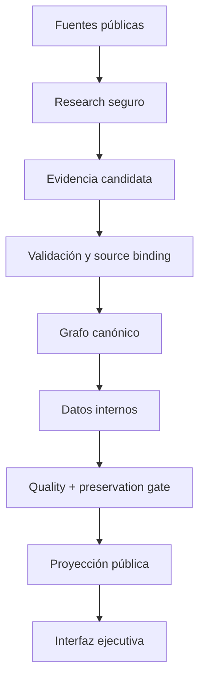

# Arquitectura v4.1

## Contrato de diseño

La aplicación muestra una sola interfaz y oculta toda la complejidad operativa. El modelo interno separa hechos, señales e interpretaciones; ninguna señal débil se convierte automáticamente en relación comercial.

## Capas

| Capa | Responsabilidad | Invariante |
|---|---|---|
| Dominio | normalización, aliases, campos y confianza | una entidad canónica por sección |
| Procedencia | limitar evidencia al dato que prueba | ninguna fuente vecina en un popup |
| Grafo | relaciones distribuye/integra/señal | una arista por par y tipo |
| Gaps | inventario estricto de deuda | una búsqueda vacía no cierra nada |
| Research | planificar, descubrir, extraer y aprender | HTTP 200 no es éxito de negocio |
| Persistencia | estado y publicación | escritura completa o rollback |
| Publicación | fragmentos aptos para navegador | `data/current` nunca llega a Pages |
| Esquema BI | dimensiones tipadas y orden de comparación | aditivo; una columna vacía no fabrica datos |
| Confianza | fuerza, primariedad, actualidad y contradicción | contar URLs nunca basta |
| Análisis local | filtros, estado de URL e informes | el informe usa exactamente las filas filtradas |

## Frontera de acreditación

`data/current` conserva evidencia, linaje y arqueología completos. `engine.publication` proyecta únicamente `WESTCON_DOCUMENT`, `PUBLIC_PRIMARY` y `PUBLIC_SECONDARY` que hayan superado suficiencia tipada y no tengan binding de descubrimiento. El navegador no decide qué fuente es válida: recibe ya una proyección acreditativa.

Discovery sirve para encontrar una fuente mejor. No puede cerrar un gap, incrementar soporte o entrar en el catálogo visible. Las derivaciones internas (`westcon_fit`, clasificaciones y sinergias) usan inputs sustentados y una regla reproducible; nunca se envían como consulta literal al research web.

## Ciclo de aprendizaje

Cada gap conserva intentos, evidencias aceptadas, fallos consecutivos y próxima fecha. El plan pondera sección, campo, criticidad, rendimiento observado y saturación. Los dominios conservan salud y abren circuito después de fallos repetidos; los éxitos relevantes aumentan su prioridad futura.

La cola de descubrimiento no promociona por sí sola un candidato externo. Una señal necesita evidencia suficiente y, cuando corresponde, corroboración independiente antes de incorporarse como hecho.

## Seguridad

- URLs absolutas HTTP(S), sin credenciales y solo puertos 80/443.
- Rechazo de localhost, IP privada, link-local, reservada, multicast y destinos DNS mixtos.
- Revalidación de la URL final tras redirecciones.
- Descarga en streaming con límite de bytes, timeout y reintentos acotados.
- El dataset público es una proyección, no una copia de la inteligencia interna.

## Consistencia

`atomic_write_many` prepara todos los ficheros antes de sustituirlos y restaura los anteriores si una publicación falla. `ProcessLock` impide ciclos locales simultáneos y GitHub Actions añade un mutex global. El publisher aborta si `main` ha avanzado desde el checkout, evitando sobrescribir investigación más reciente.

Antes de publicar, `engine.preservation` compara snapshots de entrada y salida. Cualquier pérdida no exceptuada de entidad, valor, evidencia, relación o capacidad Westcon documentada convierte el build en inválido.
